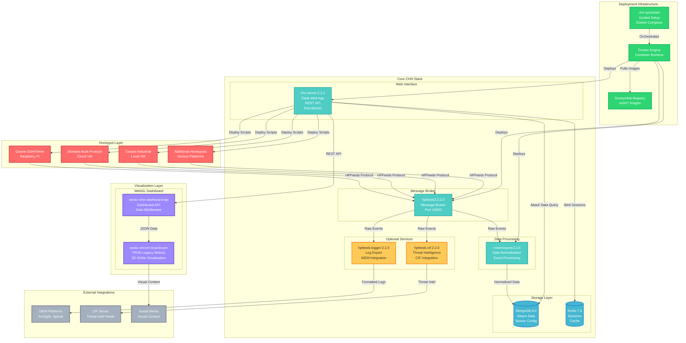

# CHN Stack Architecture Diagram

## Complete CHN Modernization Architecture

## Component Details

### **Honeypot Layer**
- **Multi-Platform Deployment**: Raspberry Pi, Cloud VMs, Local Infrastructure
- **Protocol Diversity**: SSH/Telnet (Cowrie), Multi-Protocol (Dionaea), Industrial (Conpot)
- **Real-Time Data**: Live attack capture and HPFeeds transmission

### **Core CHN Stack**
- **hpfeeds3**: Modern Python 3 message broker with asyncio support
- **mnemosyne**: Data normalization and MongoDB integration
- **chn-server**: Flask web interface with REST API and sensor management
- **Storage**: MongoDB 8.0 for persistence, Redis 7.4 for caching

### **Visualization Layer**
- **seckc-encom-boardroom**: TRON Legacy-inspired WebGL 3D visualization
- **seckc-mhn-dashboard-api**: Middleware API for dashboard data integration
- **Real-Time Rendering**: Live attack visualization on 3D globe

### **Optional Services**
- **hpfeeds-logger**: Multi-format log export (ArcSight, Splunk, JSON)
- **hpfeeds-cif**: Collective Intelligence Framework integration

### **Deployment Infrastructure**
- **chn-quickstart**: Guided Docker Compose setup with interactive configuration
- **Container Registry**: Production images available on DockerHub (ax0n/*)
- **One-Command Deployment**: Complete stack deployment via docker-compose

## Key Architectural Benefits

🚀 **Modern Stack**: Ubuntu 24.04, Python 3.12, MongoDB 8.0  
⚡ **High Performance**: 330MB memory footprint, <2ms response times  
🔄 **Real-Time Pipeline**: Attack → HPFeeds → Normalization → Visualization (seconds)  
🎨 **Visual Impact**: Movie-quality 3D visualization for threat intelligence  
📦 **Easy Deployment**: One-command setup with guided configuration  
🌐 **Multi-Platform**: Cloud, on-premises, and edge deployment support  

## Data Flow Summary

1. **Attack Capture**: Honeypots detect and log malicious activity
2. **Message Transmission**: HPFeeds protocol sends events to broker
3. **Data Normalization**: Mnemosyne processes and standardizes event data
4. **Storage & API**: MongoDB persistence with REST API access
5. **Visualization**: WebGL dashboard renders real-time 3D attack visualization
6. **Integration**: Optional SIEM and threat intelligence platform integration